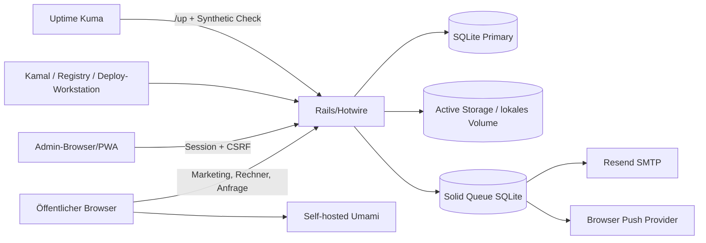

# Architektur- und Produktionsreife-Review

**Projekt:** Zapfe Rails  
**Prüfdatum:** 16.07.2026  
**Branch:** `architecture-review`  
**Commit:** `6941271fbc1d41af00eb3e71acfe145ca7796a9d`  
**Urteil:** **Noch nicht produktionsfreigabefähig**

> Dieses Dokument ist ein technischer Architektur-, Security- und
> Compliance-Review des Repository-Stands. Es ist keine Rechts- oder
> Steuerberatung und keine Zusicherung von DSGVO-, BFSG-, GoBD- oder sonstiger
> Rechtskonformität. Bedingte Betreiberpflichten sind ausdrücklich als solche
> markiert.

## 1. Executive Summary

Die Anwendung hat eine gute Grundlage: einen verständlichen Rails-Monolithen,
Standardmechanismen für CSRF und HTML-Escaping, TLS/HSTS und sichere Cookies,
fachliche Services, Foreign Keys und Unique-Indizes, Dokument-Snapshots, einen
non-root Container sowie 178 vollständig grüne Rails-Tests. Im manuellen
Security-Scan wurden keine bestätigte SQL Injection, RCE oder Template Injection
gefunden.

Eine Produktionsfreigabe ist dennoch nicht vertretbar. Drei Befunde sind
kritisch:

1. **SEC-001:** Der produktive Request-/Session-/Upload-/Rich-Text-Stack enthält
   aktuell bekannte Schwachstellen in Rails, Rack, Active Storage, Puma, Trix,
   Loofah und Nokogiri.
2. **OPS-001:** Das gesamte Kernsystem liegt auf einem lokalen Volume eines
   einzelnen Hosts; ein konsistentes Offsite-Backup und erfolgreicher Restore
   sind nicht belegt.
3. **OPS-002:** Ein vorhandenes Staging→Produktion-Skript löscht das
   Produktionsvolume vor Prüfung und Kopie; sein Kopierbefehl ist wahrscheinlich
   defekt. Das Skript darf nicht ausgeführt werden.

Weitere hohe Release-Risiken betreffen Admin-Berechtigungen, Passwort/MFA und
Session-Widerruf, unvollständige Datenschutzinformationen und fehlende
Lösch-/Betroffenenrechteprozesse, unbegrenzt gespeicherte Kontakt-PII im Browser,
Resend-US-Transfers, Rechnungspflichtangaben/E-Rechnung, Mail- und Jobfehler,
Monitoring/Incident Response, Schema-Drift, partielle Auftragserstellung sowie
rote Browser-, Lint- und Security-Gates.

### Freigabeempfehlung

**No-Go**, bis mindestens Welle 0 und Welle 1 aus Abschnitt 11 abgeschlossen und
belegt sind. Danach erneuter Security-, Restore-, Datenschutz-, Rechnungs- und
Release-Gate-Review. Die Befunde sind gut behebbar; sie sprechen nicht für einen
Neubau der Anwendung.

## 2. Scope, Methode und Grenzen

Geprüft wurden Repository, Git-Stand, Routen, Models, Controller, Services,
Jobs, Mailer, Views, Stimulus/PWA, Datenbankschema und Migrationen, Active
Storage, Deployment/Kamal/Docker, CI, Tests und Betriebsdokumentation.

Ausgeführt wurden:

- Brakeman: vollständiger Scan, 79 Checks, eine manuell als nicht ausnutzbare
  `permit!`-Warnung.
- Bundler Audit gegen ruby-advisory-db, aktualisiert am 15.07.2026: **rot**.
- Importmap Audit: **grün**.
- Produktions-Rack-Smoke für Login-Header/Cookie: **grün**.
- Rails: 178 Tests, 706 Assertions, **grün**.
- Seeds: **grün**.
- RuboCop: 264 Dateien, 30 Offenses, **rot**.
- Rails-Systemtests: 13 Runs, 6 Failures, 2 Errors, **rot**.
- Playwright: 2 bestanden, 1 fehlgeschlagen, **rot**.

Nicht geprüft werden konnten reale Produktionsdaten, Host-/Firewall-/Patchstand,
Provider-Dashboards, echte Backups und Restores, Uptime-Kuma-Alarmzustellung,
Resend-/Umami-Livekonfiguration, Verträge/AVV/TIA, Umsatz/Mitarbeiterzahl,
tatsächlicher Vertragsschluss sowie außerhalb des Repositories geführte VVT,
TOMs oder Incident-Prozesse. Diese Punkte gelten nicht stillschweigend als
erfüllt.

## 3. Systemübersicht

Der Rails-8.1-Monolith verbindet zwei Schutzbereiche:

- öffentliche Marketing-, Getränke-, Rechner- und Anfrageoberfläche;
- authentifizierte Auftragszentrale mit Kunden, Angeboten, Rechnungen,
  Einkauf, Ressourcen, Aufgaben, Dateien und interner Administration.

Sensible Datenklassen sind Kontakt- und Veranstaltungsdaten, Kommunikation und
Freitext, Angebote/Rechnungen/Kosten/Margen, Mitarbeiter- und Aktivitätsdaten,
Dateien/PDFs, Push-Endpunkte sowie Betriebslogs. Die wichtigsten Trust
Boundaries liegen zwischen Internet und Public Rails, Adminbrowser und
Adminbereich, Rails und lokalem Volume, Rails und Resend/Push, Browser und Umami
sowie Deploy-Workstation/Registry und Hetzner-Host.

## 4. Positive Feststellungen

- Verständlicher Standard-Rails-Stack ohne unnötige verteilte Systeme.
- CSRF, normales View-Escaping, parent-gescopte Admin-Downloads und
  `Content-Disposition: attachment`.
- TLS/HSTS, `Secure`/`HttpOnly`/`SameSite=Lax`, X-Frame-Options, `nosniff` und
  Referrer-Policy im Produktions-Smoke bestätigt.
- bcrypt, normalisierte eindeutige Admin-E-Mail, Login-Rate-Limit und generische
  Reset-Antwort.
- Foreign Keys, fachliche Unique-Indizes, Locks und Transaktionen an vielen
  kritischen Stellen.
- Finalisierte Angebote/Rechnungen besitzen Snapshots und Änderungsbarrieren.
- Non-root Runtime-Container und getrennte SQLite-Dateien für Primary, Cache,
  Queue und Cable.
- PWA cached bewusst kein authentifiziertes HTML; Push ist opt-in.
- Staging verhindert Kundenversand von Angeboten/Rechnungen.
- 178 Rails-Tests und Seeds laufen reproduzierbar grün.

## 5. Security Findings

Jede Zeile enthält Priorität, Eintrittswahrscheinlichkeit, Auswirkung, konkreten
Nachweis, Maßnahme, Verifikation und groben Aufwand. `S/M/L/XL` entsprechen
ungefähr Stunden, wenigen Tagen, bis zwei Wochen beziehungsweise einem größeren
Projekt inklusive Prozessarbeit.

| ID | Priorität / W'keit | Auswirkung und Nachweis | Maßnahme / Verifikation | Aufwand |
|---|---|---|---|---|
| **SEC-001** | **kritisch**, hoch | Öffentlicher Stack mit bekannten Session-, XSS-, Path-Traversal-, File-Exposure- und DoS-Advisories. `Gemfile.lock`; aktuelles Bundler Audit rot: Rails/ActionPack/ActiveStorage 8.1.2, Rack 3.2.5, rack-session 2.1.1, Puma 7.2.0, Trix 2.1.16, Loofah 2.25.0, Nokogiri 1.19.1 u. a. | Auf gepatchte Versionen aktualisieren, Advisory für Advisory bewerten. Verifizieren: Bundler Audit, Brakeman und vollständige Suites grün. | M |
| **SEC-002** | hoch, mittel | Jedes aktive Admin-Konto kann Konten/Passwörter, Systemeinstellungen, Finanzen und Dokumente verwalten. `Admin::BaseController`, `AdminUsersController`. | Owner/Admin/Member oder Policies; negative Autorisierungstests je privilegierter Aktion. | L |
| **SEC-003** | hoch, mittel-hoch | Ein Zeichen langes Passwort ist laut Validierungsprobe gültig; keine MFA. Bei Kontoübernahme Vollzugriff. `AdminUser`. | Lange Passphrase, Breach-Password-Prüfung, WebAuthn/Passkey oder TOTP plus Recovery-Test. | M–L |
| **SEC-004** | hoch, mittel | Passwort-/Rollenänderung widerruft bestehende Cookie-Sessions nicht; keine belegte Idle-/Max-Laufzeit; Login ohne explizites `reset_session`. | Session-Version, Rotation bei Login, Widerruf und Laufzeiten. Test mit alter Session nach Credential-Wechsel. [Rails empfiehlt eine neue Session nach Login](https://guides.rubyonrails.org/security.html#session-fixation-countermeasures). | M |
| **SEC-005** | mittel, hoch | Öffentlicher Passwort-Reset ohne IP-/Account-Cooldown kann Mail/Queue/Quota belasten. | Doppelte Rate-Limits, Telemetrie; Burst-/Cooldown-Tests. | S–M |
| **SEC-006** | mittel-hoch, mittel | Attachment-Schutz ist uneinheitlich; Client-MIME wird vertraut, mehrere Attachment-Modelle ohne Größe/Typ. Malware-/Parser-/Storage-Risiko. | Zentrale Policy, Magic Bytes, Re-Encoding/PDF-Prüfung, Quarantäne/Malware-Option; Negativtests. | L |
| **SEC-007** | mittel, mittel | Monitoring-Token in Query kann in Proxy-, Uptime-, Browser- oder Exportlogs landen. | Bearer/dedizierter Header, Redaction, Rotation; prüfen, dass kein Token geloggt wird. | S |
| **SEC-008** | mittel, mittel | CSP erlaubt Scripts von jeder HTTPS-Origin und Inline-Styles; begrenzte XSS-Schadensreduktion. | Konkrete Origins/Nonce, zunächst Report-Only; Browser-Smoke und Report-Auswertung. | M |
| **SEC-009** | mittel, hoch | Spam-Logger schreibt E-Mail, volle IP und User-Agent explizit und umgeht Parameterfilter. | Entfernen/kürzen/hashen, kurze Retention; Staging-Log-Test ohne direkte PII. | S |
| **SEC-010** | mittel, hoch | Login/Logout/Reset/Konten-/Settingsänderungen nicht sicherheitsauditierbar. | Minimales manipulationserschwertes Security-Audit mit Actor, Request-ID und Alarmmatrix; Incident-Walkthrough. | M |
| **SEC-011** | niedrig-mittel, niedrig-mittel | Keine Rails-Host-Allowlist und keine Permissions-Policy; Proxy-Hosts mindern Risiko. | Hosts explizit erlauben, ungenutzte Browserfähigkeiten deaktivieren; Header-/Host-Test. | S |
| **SEC-012 / PWA-001** | niedrig-mittel, niedrig | Admin-Service-Worker liegt unter `/` und kontrolliert gesamten Origin, cached aktuell aber nur Manifest. | Worker/Scope auf `/admin/` begrenzen oder globale Invariante testen; Cache-/Scope-Browsertest. | S–M |

Als strukturierte Verifikationsbasis eignet sich [OWASP ASVS 5](https://owasp.org/projects/),
ergänzt durch den [offiziellen Rails Security Guide](https://guides.rubyonrails.org/security.html).

## 6. DSGVO und Privacy by Design

Die zentralen Maßstäbe sind insbesondere Speicherbegrenzung und
Rechenschaftspflicht (Art. 5), Informationspflichten (Art. 13), Datenschutz durch
Technikgestaltung (Art. 25), Auftragsverarbeitung (Art. 28), VVT (Art. 30),
Sicherheit (Art. 32) und gegebenenfalls DPIA (Art. 35) der
[DSGVO](https://eur-lex.europa.eu/eli/reg/2016/679/oj/?locale=de).

| ID | Priorität / W'keit | Auswirkung und Nachweis | Maßnahme / Verifikation | Aufwand |
|---|---|---|---|---|
| **PRIV-001** | hoch, hoch | Datenschutzerklärung bildet Hosting/Logs, Resend, internes CRM/Aufträge/Rechnungen/Dateien, Push, Empfänger, Transfers und Fristen nicht vollständig ab. `datenschutz.html.erb` vs. reale Flows. | Verarbeitung inventarisieren; versionierte Art.-13-Information pro Zielgruppe; juristische Schlussprüfung. | L |
| **PRIV-002 / PRIV-006 / PRIV-007** | hoch, hoch | Kein belegtes Retention-/Lösch-, Rechte-, VVT-/TOM-/Breach-/DPIA-Verfahren. Archivierung ist keine Löschung; Snapshots/Anhänge/Backups erschweren Ad-hoc-Rechte. | Matrix mit Zweck/Basis/Trigger/Frist/Legal Hold/Backup-Nachlauf; Purge-Jobs; Export-/Lösch-SOP und synthetischer Rights-Test. | XL |
| **PRIV-003** | hoch, hoch | Rechner speichert Name, Telefon, E-Mail, Event, Nachricht und Checkbox unbegrenzt in LocalStorage, ohne TTL/Löschweg. | PII nicht persistent speichern, nach Erfolg löschen oder kurze Session; Browser-Verifikation. Terminalzugriff nach [§ 25 TDDDG](https://www.gesetze-im-internet.de/ttdsg/__25.html) getrennt bewerten. | S–M |
| **PRIV-004** | mittel-hoch, hoch | Pflichtcheckbox nennt „Zustimmung“ zur Datenschutzerklärung, obwohl Art. 6(1)(b) angegeben wird; Boolean ohne Notice-Version bleibt gespeichert. | Kenntnisnahme statt Einwilligung; echte optionale Consents getrennt, versioniert und widerrufbar. | S–M |
| **PRIV-005** | hoch, hoch | AVV/DPA, Subprozessoren, Retention und Transfers für Hetzner, Resend, Mail, Push, Umami/Monitoring nicht belegt. Resend nennt US-Hauptverarbeitung und US-Metadatenhaltung auch bei EU-Versandregion. | Anbieterregister, AVV/DPA/TIA, Regionen/Tracking/Retention prüfen und Notice anpassen. [Resend DPA](https://resend.com/legal/dpa), [Resend Regions](https://resend.com/docs/dashboard/domains/regions), [Hetzner DPA-Hinweis](https://docs.hetzner.com/general/company-and-policy/data-protection-at-hetzner/). | L |
| **PRIV-008** | mittel-hoch, mittel | Umami läuft ohne Consent-Layer. Cookie-frei beweist nicht konkrete Konfiguration, §25-Ausnahme, Art.-6-Basis oder Retention. | Live-Netzwerk, Version, IP/UA/Identifier, Events, Retention und Zugriff prüfen; danach Notwendigkeit/Interessenabwägung oder Consent. | M |
| **PRIV-009** | mittel, mittel | Push-Payload enthält Kundenname/Aufgabe und kann auf Sperrbildschirm/Browserinfrastruktur sichtbar werden; Offboarding offen. | Generische Payload, Details nach Login; Device-/Offboarding-/Beschäftigtenprozess testen. | S–M |
| **PRIV-010** | mittel, hoch | Pflichttelefon ohne dokumentierte Notwendigkeit; sichtbares `company`-Feld wird verworfen, kann aber geloggt werden; breite Freitexte/Snapshots. | Pflichtfelder begründen, Company korrekt behandeln/entfernen, Freitext-/Logminimierung. | S–M |

### Aufbewahrungsrahmen

Nicht alles darf sofort gelöscht werden. Buchungsbelege sind grundsätzlich acht
Jahre, Geschäftsbriefe grundsätzlich sechs Jahre aufzubewahren; Beginn und
Sonderfälle müssen mit Steuerberatung bestimmt werden
([AO § 147](https://www.gesetze-im-internet.de/ao_1977/__147.html),
[HGB § 257](https://www.gesetze-im-internet.de/hgb/__257.html)). Diese Fristen
rechtfertigen keine pauschale Langzeitspeicherung aller Leads, Logs, Push-Daten
oder Browserdaten.

## 7. Legalität in Deutschland

| ID | Priorität / Bedingung | Auswirkung und Nachweis | Maßnahme / Verifikation | Aufwand |
|---|---|---|---|---|
| **LEG-001** | mittel | Impressum enthält wesentliche Angaben, verweist aber veraltet auf §55 RStV. Betreiber-/Register-/USt-Tatsachen nicht verifiziert. | Tatsachen prüfen; [§5 DDG](https://www.gesetze-im-internet.de/ddg/__5.html) erfüllen; §18(2) MStV nur bei journalistisch-redaktionellem Angebot korrekt nennen ([MStV §18](https://www.gesetze-bayern.de/Content/Document/MStV-18)). | S + extern |
| **LEG-002** | mittel, bedingt | VSBG-Erklärung fehlt. Ausnahme gilt bei höchstens zehn Beschäftigten am 31.12. des Vorjahres. | Mitarbeiterzahl/Teilnahme prüfen und [§36-VSBG](https://www.gesetze-im-internet.de/vsbg/__36.html)-Hinweis ergänzen, falls nötig. Kein alter OS-Link: EU-Plattform seit 20.07.2025 eingestellt ([EU 2024/3228](https://eur-lex.europa.eu/eli/reg/2024/3228/oj/?locale=de)). | S + extern |
| **LEG-003** | hoch falls anwendbar, sonst mittel | BFSG hängt von elektronischem Abschlussprozess und Kleinstunternehmerstatus ab; Nachweis fehlt. | Beschäftigte/Umsatz/Bilanz und Vertragsschluss bestimmen; Scope juristisch prüfen. [BFSG §2](https://www.gesetze-im-internet.de/bfsg/__2.html), [§3](https://www.gesetze-im-internet.de/bfsg/__3.html). | M–L + extern |
| **LEG-004** | hoch, hoch bei Mischsätzen | Rechnungs-PDF zeigt bei mehreren Steuersätzen nur aggregierte MwSt. und keine Rate je Zeile; [UStG §14(4) Nr.7/8](https://www.gesetze-im-internet.de/ustg_1980/__14.html) verlangt Aufschlüsselung. | Netto/Basis und Steuerbetrag je Steuersatz ausweisen; PDF-Text-/Golden-Test mit 7%+19%. | M |
| **LEG-005 / ARCH-005** | hoch, mittel | Nummern mit `count+1`; Storno nur Status; PDF/Filesystem und DB nicht vollständig atomar. Risiko für Eindeutigkeit, Korrektur und Prüfpfad. | DB-Counter/Retry, idempotente Finalisierung, Storno-/Korrekturdokument, Checksumme und Audit; Concurrency-/Failure-Tests. | L |
| **LEG-006** | hoch, zeitkritisch/bedingt B2B | Nur PDF, keine strukturierte E-Rechnung. Übergang grundsätzlich bis Ende 2026, bei Vorjahresumsatz ≤800.000 EUR bis Ende 2027; Empfang seit 2025 erforderlich. | Kundenmix/Umsatz klären; XRechnung/ZUGFeRD, Validierung, Empfang und Archivierung planen. [BMF FAQ](https://www.bundesfinanzministerium.de/Content/DE/FAQ/e-rechnung.html). | L–XL |
| **LEG-007** | mittel-hoch, bedingt | Keine AGB/Widerrufs-/Fernabsatzinformationen im Repo. Auch späterer Abschluss per Mail/Telefon kann Fernabsatz sein; Terminausnahme ist leistungsabhängig. | Reale Customer Journey/Vertragsschluss juristisch prüfen; Verbraucherinformationen/Bestätigung entsprechend gestalten. | extern + M |
| **LEG-008** | niedrig-mittel, bedingt | PAngV kann bei konkreter B2C-Preiswerbung greifen; individuelle Angebote sind häufig ausgenommen. Rechner zeigt Preisindikation. | Sämtliche beworbenen Preise auf Klarheit, Brutto und Angebotscharakter prüfen; [PAngV](https://www.gesetze-im-internet.de/pangv_2022/). | S–M + extern |

## 8. Betrieb, Zuverlässigkeit und Recovery

| ID | Priorität / W'keit | Auswirkung und Nachweis | Maßnahme / Verifikation | Aufwand |
|---|---|---|---|---|
| **OPS-001** | **kritisch**, mittel | Primary/Queue/Cable/Cache/Uploads auf einem Host/Volume; kein belegtes Backup, Offsite, RPO/RTO oder Restore. Totalverlust möglich. | Konsistente verschlüsselte Offsite-Sicherung, Erfolgsalarm, RPO/RTO; regelmäßiger isolierter Full-Restore mit Beleg. | L |
| **OPS-002** | **kritisch**, mittel bei Nutzung | `replace_prod_storage_from_staging` löscht Ziel vor Prüfung, ignoriert Variablen, ohne Backup/Rollback; Kopierbefehl durch Zeilenumbruch wahrscheinlich defekt. | Sofort sperren. Nur fail-safe Tool mit Bestätigung, Snapshot, Checksummen, atomarem Cutover und Wegwerf-Volume-Test. | M |
| **OPS-003** | hoch, mittel | Angebot/Rechnung wird vor erfolgreichem `deliver_later`-SMTP-Handoff als sent markiert. UI kann falsche Zustellung behaupten. | Outbox/queued/delivered/failed, Provider-ID, idempotenter Retry und Reconciliation; SMTP-Fehlertest. | L |
| **OPS-004** | hoch, mittel | Keine explizite Job-Retry/Discard/Dead-letter-Strategie; Reminder wird vor Push-Erfolg als erfolgt markiert. | Fehlerklassen/Backoff/Idempotenz, Failed-job-Alarm und Replay-Runbook; Jobtests. | M |
| **OPS-005 / OPS-006** | hoch, hoch | `/up` prüft Boot; Synthetic Check weder DB-Schreiben noch Queue/SMTP/Storage. Keine belegten Alarme für Fehler, Disk, Backup, Queue, Bounces; keine datensparsame zentrale Log-/Incident-/Breach-Operationalisierung. | Health-Matrix, Error Tracking, datensparsame zentrale Logs, SLO/Alarm und Incident-/72h-Probe. | L |
| **OPS-007** | mittel-hoch, mittel | `db:prepare` läuft beim Web-Boot ohne belegte kompatible Migrations-/Rollbackstrategie. | Separater Migration-Step, Vorbackup, Lock-/Kompatibilitätsregel, Post-deploy Smoke und Rollback-Test. | M–L |
| **OPS-008 / OPS-009** | hoch, mittel | Ein Host koppelt Web, Jobs, Daten und Dateien; Web-Restart stoppt Queue. SQLite-Wartung, Integritätscheck, Diskalarm und konsistenter DB+File-Snapshot fehlen. | Bewusstes Single-node-Runbook, Ressourcenlimits, `integrity_check`, WAL/Checkpoint/Vacuum, Diskalarm; später anhand RTO entkoppeln. | L |
| **OPS-010** | mittel, mittel | Base Image/apt nicht per Digest/Version fixiert; kein OS/Image-Scan, SBOM, Signatur oder Provenance. | Digest/Updateprozess, Trivy/Grype o.ä., SBOM und signierte Artefakte; Build-Gate. | M |
| **OPS-011** | mittel, mittel | Deploy als root, personenspezifischer SSH-Key-Pfad; Least Privilege, Rotation, Host-Härtung nicht dokumentiert. | Deploy-User mit minimalen Rechten, Secret Manager/Rotation, Firewall/Patch-/SSH-Runbook. | M |
| **OPS-012** | mittel, mittel | Keine SLO, Last-/Datenmengenannahme, p95-Baseline oder Kapazitätsgrenzen. | SLI/SLO, Volumentest, Disk/DB/Upload-Budget und Wartungsfenster. | M |

## 9. Architektur, Qualität, Performance, Accessibility und PWA

| ID | Priorität | Auswirkung und Nachweis | Maßnahme / Verifikation | Aufwand |
|---|---|---|---|---|
| **ARCH-001** | hoch | Schema enthält vier Tabellen ohne Migrationen/aktuellen Code; frischer Aufbau kann Produktion nicht reproduzieren. | Ursprung klären, per Migration entfernen/rekonstruieren; leeres `db:prepare` + Schema-Vergleich in CI. | M |
| **ARCH-002** | hoch | Direkter Auftrag wird vor Template-Materialisierung committed; Fehler hinterlassen Teilauftrag. | Gesamten Use Case in eine Transaktion; Rollback-/Ressourcenkonflikttests. | M |
| **ARCH-003** | mittel-hoch | Statusübergänge/Labels in Models, Services, Controllern und Views verteilt; unerwartete Sprünge programmatisch möglich. | Explizite Commands/Transition-Policy und Contract-Tests. | L |
| **ARCH-004** | mittel | OrdersController (204 Zeilen), Public Inquiry und 250–323-Zeilen-Views bündeln mehrere Verantwortungen. | Use-Case-/Query-/Form-Grenzen schrittweise extrahieren; nicht kosmetisch zerteilen. | L |
| **QUAL-001** | hoch | RuboCop, Systemtests, Playwright und Security-Gates rot; Baseline taugt nicht als Release-Signal. | Gewünschtes Verhalten festlegen, Gates grün machen und als verpflichtende PR-Checks schützen. | M |
| **QUAL-002** | hoch | Keine Tests für Jobs, SMTP/Push/Queue-Ausfall, Nummern-Concurrency, Mischsteuer, Template-Rollback, Restore, Retention. Keine Coverage-Messung. | Risikobasierte Failure-/Concurrency-/Recovery-Suite und Coverage-Trend. | L |
| **QUAL-003** | mittel-hoch | Viele Stimulus-Controller ohne JS-Unit-/Component-Tests; nur drei Playwright-Specs; kein axe/Lighthouse-Gate. | JS-Tests und öffentliche/authentifizierte axe-Smokes; PWA/Auth/Keyboard-Flows. | L |
| **QUAL-004** | niedrig-mittel | Nicht verwendete Scaffold-Views und veraltete Testdokumentation erzeugen falsche Erwartungen. | Entfernen/aktualisieren; CI-Kommandos als einzige Wahrheit dokumentieren. | S |
| **PERF-001** | mittel | Admin-Listen unpaginiert; Ressourcenkalender selektiert pro Zelle erneut in Ruby. | Pagination, indexierte Kalenderstruktur, Query-count/Bullet und realistische Volumentests. | M |
| **PERF-002** | niedrig-mittel | Ca. 113 MB Bildquellen, einzelne Dateien 6–17 MB, werden in Docker-Buildkontext kopiert. | Asset-Inventar, Quellen außerhalb Runtime-Image, nur optimierte Varianten ausliefern. | S–M |
| **A11Y-001** | hoch falls BFSG, sonst mittel | Kein WCAG-/BFSG-Nachweis, keine Kontrast-/Zoom-/Screenreader-Matrix oder Barrierefreiheitserklärung. | WCAG-2.2-AA-Audit + automatisierte und manuelle Nachweise; BFSG-Scope juristisch klären. | L–XL |
| **A11Y-002** | mittel-hoch | Mobile Menüs ohne `aria-expanded/controls`, Fokusmanagement, Escape oder Fokus-Rückgabe; Admin-Mobile-Test rot. | Accessible disclosure/dialog pattern und Keyboard-Browsertests. | M |
| **A11Y-003** | mittel | Kein Skip-Link; aktive Hauptnavigation nur visuell, kein `aria-current`. | Wiederholte Blöcke überspringbar machen und Current State auszeichnen. [WCAG 2.4.1](https://www.w3.org/WAI/WCAG22/Understanding/bypass-blocks). | S |
| **A11Y-004** | mittel-hoch | Vier autoplay/loop-Videos ohne Pause; Reduced Motion stoppt sie und Page-Animationen nicht vollständig. | Pause-/Stop-Steuerung, Reduced-Motion-Verhalten und Test. [WCAG 2.2.2](https://www.w3.org/WAI/WCAG22/Understanding/pause-stop-hide.html). | M |
| **A11Y-005** | mittel | Öffentliche Flashes ohne Live-Region; Formularfehler ohne belegten Fokus/`aria-invalid/describedby`; Medienalternativen uneinheitlich. | Fehlerzusammenfassung/Fokus, Status-Live-Region, fachliche Alt-/Textalternativen; Screenreader-Test. | M |
| **PWA-002** | mittel | Sofortige Worker-Aktivierung ohne Update-UX; Install-/Push-Fehler ohne Recovery; keine Offline-/Update-/Permission-/Click-Tests. | Explizite Online-only-UX, Fehlerstatus, Updateentscheidung und PWA-Browsersuite. | M |

## 10. Gate- und Evidenzprotokoll

| Prüfung | Ergebnis | Einordnung |
|---|---|---|
| Rails Unit/Model/Controller/Service | 178 Runs, 706 Assertions, grün | Gute fachliche Basis; deckt Failure/Recovery nicht ausreichend ab. |
| Seeds | grün | Reproduzierbar im Testkontext. |
| Rails System | 5/13 bestanden; 6 Failures, 2 Errors | Überwiegend veraltete UI-Erwartungen, aber Gate sicher rot. |
| Playwright | 2/3 bestanden | Rechner-Smoke erwartet alte H1. |
| RuboCop | 30 Offenses | Kleine Layout/Style-Probleme, aber CI rot. |
| Brakeman Vollscan | 79 Checks; 1 Medium-Warnung | `permit!` im Spam-Helper nicht als Mass Assignment bestätigt. |
| Normaler Brakeman-Wrapper | Exit 5 | Erzwingt neueste Scanner-Version und liefert derzeit keinen normalen grünen Gate-Lauf. |
| Bundler Audit | rot | Materieller Release-Blocker SEC-001. |
| Importmap Audit | grün | Keine bekannte Importmap-Schwachstelle. |
| Header/Cookie Smoke | grün | HSTS, sichere Cookies, CSP, XFO, nosniff, Referrer Policy bestätigt. |
| Passwortprobe | `x` gültig | SEC-003 bestätigt. |
| Secret-Suche | kein Rohsecret bestätigt | Env-/Key-Dateien werden ignoriert; Betriebsrotation dennoch offen. |

## 11. Priorisierte Umsetzungsreihenfolge

### Welle 0 – sofort, vor weiteren riskanten Deployments

1. `script/replace_prod_storage_from_staging` technisch sperren und nicht nutzen.
2. Abhängigkeiten aus SEC-001 patchen; Security-Gates vollständig grün.
3. Konsistentes Backup aller fachlichen DB-/Dateidaten erstellen und isolierten
   Restore erfolgreich durchführen; RPO/RTO festhalten.
4. Prüfen, ob aktuelle Produktion bereits gefährdete Dependencies/unklare
   Backups enthält; Zugangstokens/Logs nicht unnötig exponieren.

### Welle 1 – zwingend vor Produktionsfreigabe

1. Admin-RBAC, Passwortstandard/MFA, Sessionrotation/-widerruf.
2. Schema reproduzierbar machen; Template-Transaktion und Dokumentnummern härten.
3. Mail-Outbox/Delivery-Status, Job-Retry/Failed-job-Alarm und Monitoring/
   Incident-Runbook.
4. Art.-13-Information, Anbieter-/Transferregister, LocalStorage-PII und
   Consent/Kenntnisnahme korrigieren.
5. Lösch-/Retention-/Betroffenenrechtekonzept einschließlich Backups.
6. Gemischte Steuersätze korrekt; E-Rechnungs-Zeitplan und tatsächlichen
   B2B-/Umsatzstatus klären.
7. RuboCop, Systemtests, Playwright und normale Security-Wrapper grün.
8. VSBG/BFSG/Fernabsatz/Impressum anhand realer Betreiberfakten entscheiden.

### Welle 2 – zeitnah nach Freigabe

- Zentrale Upload-Policy, CSP-/Host-/Permissions-Härtung, Security-Auditlog.
- Error Tracking, SLO/SLI, Queue/Disk/Backup/Bounce-Metriken.
- Accessibility-Menüs, Skip-Link, Fehlerfeedback, Video-Pause und axe-Smokes.
- Pagination/Query-Budgets, SQLite-Wartung und Capacity Baseline.
- VVT, TOM, Breach-/Rights-SOP als wiederkehrend getestete Betriebsprozesse.

### Welle 3 – später beziehungsweise bei Wachstum

- Worker/Files/DB anhand realer RTO- und Lastanforderungen entkoppeln.
- Image-SBOM/Signatur/Provenance und Runtime-Asset-Bereinigung.
- Status-/Use-Case-Architektur weiter zentralisieren.
- PWA-Scope/Update-/Offline-UX vollständig härten.

## 12. Offene Betreiber-, Steuer- und Anwaltsfragen

1. Sind Firma, Rechtsformzusatz, Vertretung, Register, USt-ID und Anschrift
   aktuell und amtlich identisch?
2. Wie viele Beschäftigte gab es am 31.12.2025; wie hoch sind Umsatz und
   Bilanzsumme; wie verteilen sich B2C/B2B?
3. Wann und über welchen Kanal entsteht der bindende Vertrag?
4. Ist das Angebot journalistisch-redaktionell; nimmt das Unternehmen an
   Verbraucherschlichtung teil?
5. Welche Hetzner-/Resend-/IONOS/Gmail-/Push-/Umami-/Monitoring-Verträge,
   AVV/DPA, Subprozessoren, Regionen, SCC/TIA und Fristen gelten tatsächlich?
6. Welche Umami-, Resend-Tracking-, Push-, Log- und Backup-Konfiguration läuft
   produktiv?
7. Existieren VVT, TOMs, Lösch-/Rechte-/Incident-/Breach-Prozesse außerhalb des
   Repositories, und wurden sie praktisch getestet?
8. Welche Dokumente sind Buchungsbeleg/Geschäftsbrief; wie laufen Storno,
   Berichtigung, GoBD-Archiv und E-Rechnung?
9. Welche RPO/RTO, Datenmenge, Traffic- und Verfügbarkeitsziele gelten?
10. Wer besitzt Security, Datenschutz, Betrieb und Incident Response verbindlich?

## 13. Produktionsfreigabe-Check

Eine erneute Freigabeprüfung sollte erst erfolgen, wenn folgende Belege
vorliegen:

- [ ] Bundler Audit, Brakeman, Importmap, RuboCop, Rails, System und Playwright grün
- [ ] dokumentierter vollständiger Restore aus aktueller Offsite-Sicherung
- [ ] destruktives Replace-Skript entfernt oder fail-safe getestet
- [ ] Admin-RBAC, MFA/Passkey, Sessionrotation und Credential-Widerruf getestet
- [ ] Mail-/Job-Ausfall und Replay fachlich korrekt getestet
- [ ] Art.-13-Information, AVV/Transfers, Retention und Betroffenenrechte freigegeben
- [ ] LocalStorage enthält nach Submit keine dauerhafte Kontakt-PII
- [ ] Rechnungs-PDF mit mehreren Steuersätzen geprüft; E-Rechnungsplan beschlossen
- [ ] Schema aus leerer Datenbank reproduzierbar
- [ ] Incident-/Breach-/Backup-Alarme testweise ausgelöst und empfangen
- [ ] BFSG/VSBG/Fernabsatz/Impressum anhand realer Betreiberfakten entschieden
- [ ] Accessibility-Smokes plus manueller Tastatur-/Zoom-/Screenreader-Test bestanden

Erst nach diesem Nachweis ist ein erneutes **Go/No-Go** sinnvoll.
